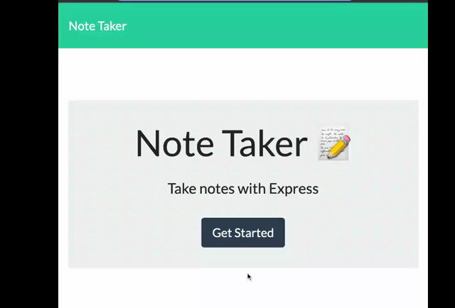

# note-taker

## Description

A note taking application that can be used to create and store plain text notes. The front end is built with HTML, CSS, and JavaScript. The backend uses Node.js with Express.  

## Features

* Backend data persistence 
* Ability to create and delete notes
* Unique ID generated for each note using [uuid](https://www.npmjs.com/package/uuid)

## Table of Contents

- [Installation](#Installation)
- [Usage](#Usage)
- [References](#Refrences)
- [License](#license)
- [Contributing](#Contributing)
- [Questions](#Questions)

## Installation

From GitHub, fork or clone the repo. The user must have Node.js installed. Once forked, run `npm i` from the root directory to install required dependencies.

To deploy to Heroku, run the command `heroku create` then push the code to the created Heroku instance.

## Usage

After clicking "Get Started" on the homepage, to add a new note click the plus sign in the top right corner and enter desired note title and note text. When finished, click the save icon in the top right to save the notes to the JSON database. Clicking the red trashcan icon will delete the note. Application deployed [here](
https://note-taker-dplyed.herokuapp.com/) using Heroku.

## References

* [Express](https://expressjs.com/)
* [uuid](https://www.npmjs.com/package/uuid)

## License

This application is covered under MIT License

  

    

      License Text
    
 
 
  Copyright (c) 2022 a-donati
  
  Permission is hereby granted, free of charge, to any person obtaining a copy
  of this software and associated documentation files (the "Software"), to deal
  in the Software without restriction, including without limitation the rights
  to use, copy, modify, merge, publish, distribute, sublicense, and/or sell
  copies of the Software, and to permit persons to whom the Software is
  furnished to do so, subject to the following conditions:
        
  The above copyright notice and this permission notice shall be included in all
  copies or substantial portions of the Software.
        
  THE SOFTWARE IS PROVIDED "AS IS", WITHOUT WARRANTY OF ANY KIND, EXPRESS OR
  IMPLIED, INCLUDING BUT NOT LIMITED TO THE WARRANTIES OF MERCHANTABILITY,
  FITNESS FOR A PARTICULAR PURPOSE AND NONINFRINGEMENT. IN NO EVENT SHALL THE
  AUTHORS OR COPYRIGHT HOLDERS BE LIABLE FOR ANY CLAIM, DAMAGES OR OTHER
  LIABILITY, WHETHER IN AN ACTION OF CONTRACT, TORT OR OTHERWISE, ARISING FROM,
  OUT OF OR IN CONNECTION WITH THE SOFTWARE OR THE USE OR OTHER DEALINGS IN THE
  SOFTWARE.

  

## Contributing

Please contact the author to be added as a collaborator to this project.
